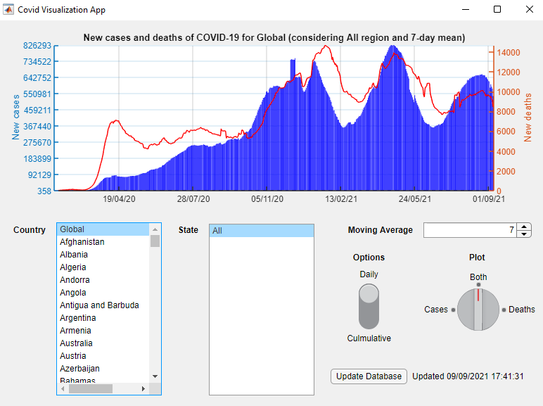

# Covid Study

Em suma, esse projeto tem como objetivo desenvolver uma interface interativa para monitorar o avanço do COVID-19 pelo mundo. Para executar essa aplicação, acesse o diretório em que o arquivo `CovidVisualizationApp.m` estiver e execute

\>\> ```` CovidVisualizationApp```` 

na janela de comando do MATLAB.




Os países podem ser selecionados na janela "Country", os estados/regiões na janela "State", a média móvel pode ser alterada na aba "Moving Average", a representação diária ("Daily") ou cumulativa ("Culmulative") pode ser selecionada por meio do botão "Options" e podemos escolher entre plotar apenas os casos, mortes ou ambos por meio da alteração do botão "Plot". Além disso, podemos atualizar a base de dados ao apertarmos o botão "Update Database", fazendo com que os últimos dados disponibilizados pela Johns Hopkins University sejam baixados.